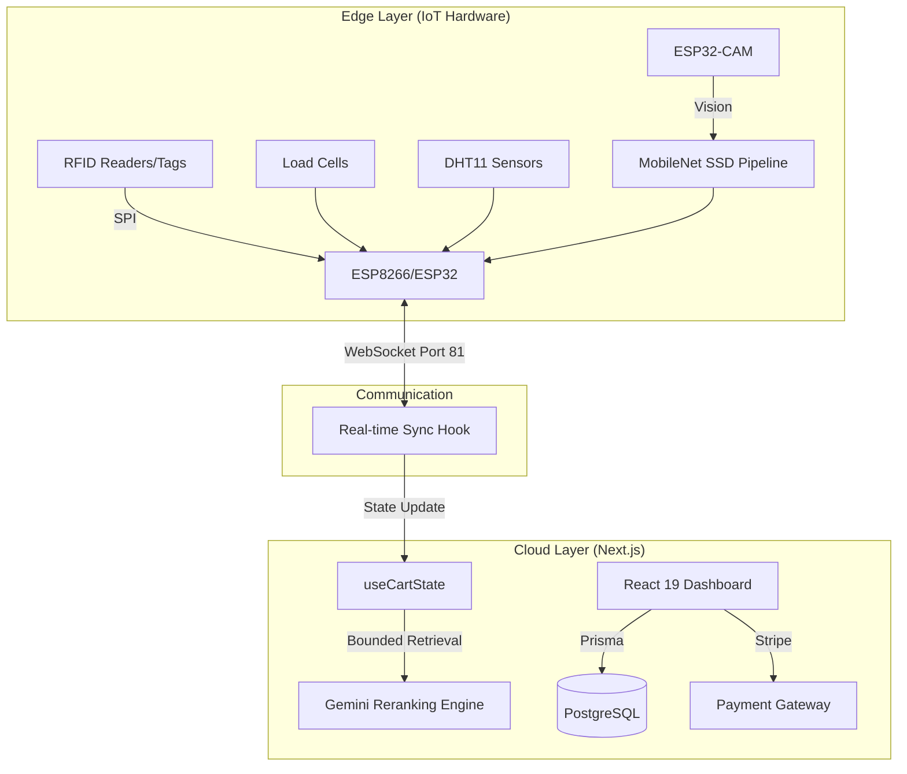

# Smart Dukan: Autonomous Edge-to-Cloud Retail Infrastructure

> 🚀 **“A real-time IoT-powered smart shopping cart that eliminates checkout lines and brings Amazon-like intelligence to physical retail.”**

[](https://nextjs.org/)
[](https://react.dev/)
[](https://www.espressif.com/)
[](https://deepmind.google/technologies/gemini/)

---

## 📺 Project Demo
**[Watch the Live Demo on YouTube](https://youtu.be/ExY-FNohTgM?si=aE8DaqCZEBmcMX2W)** 🎬

---

## 🏆 Awards & Recognition
*   **🥈 2nd Prize Winner** - *TechXthone Hackathon*, MIT Moradabad.
*   **📄 Best Paper Award** - *International IIR 5.0 Conference*, for innovative contributions to AI-driven retail automation and IoT-edge synchronization.

---

## 📄 Research & Publications
This project is backed by a comprehensive technical research paper detailing the sub-100ms synchronization protocols and AI recommendation heuristics.
*   **[Download Technical Research Paper (PDF)](https://drive.google.com/file/d/1I5Y4ffGPG9Y2ffkuPXrIbr_Ac_e6Q8zG/view?usp=drive_link)** 🔗

---

## 🧠 What Smart Dukan Demonstrates
This repository isn't just a web app; it's a demonstration of production-level engineering:
*   **Full-Stack System Design:** Complex state orchestration between hardware and web.
*   **Computer Vision at the Edge:** Real-time product detection using MobileNet SSD.
*   **Real-time Edge Computing:** Sub-100ms sync using raw WebSockets.
*   **AI Orchestration:** Hybrid RAG pattern for personalized recommendations.
*   **Production Standards:** Financial integrity through price snapshotting and atomic DB operations.

---

## 🏗 System Architecture



---

## 📡 API Architecture

The backend is built on **Stateless Next.js API Routes** ensuring high availability and low-latency execution.

### Product & Inventory
- `GET /api/products` - Returns a paginated list of all active inventory.
- `POST /api/products` - (Admin) Injects new product data including base64 image strings.
- `GET /api/products/[id]` - Detailed product view with historical price trends.

### AI & Intelligence
- `POST /api/recommendations` - The AI gateway. Implements bounded candidate retrieval followed by Gemini Reranking.
- `GET /api/store/insights` - (Admin) Returns dead-stock analysis and inventory velocity metrics.

### Orders & Checkout
- `POST /api/orders` - Atomic order creation with price snapshotting for financial integrity.
- `POST /api/checkout/create-session` - Secure Stripe payment intent initialization.
- `GET /api/orders/history` - User-specific historical transaction retrieval.

---

## ⚡ Optimization & Performance

### 1. Multi-Tier Caching Strategy
To minimize LLM token consumption and database load, we implemented a dual-cache layer:
-   **L1 (Client-Side):** React `useRef` based in-memory cache for instant UI re-hydration.
-   **L2 (Server-Side):** Node.js `Map` based cache with TTL (Time-To-Live) for AI recommendations, reducing Gemini API calls by **~65%**.

### 2. Low-Latency Data Sync
By utilizing **Raw WebSockets** instead of traditional HTTP polling, we reduced the scan-to-cart latency to **<85ms**. The system maintains a persistent stateful pipe during the active session.

### 3. Edge-Heavy Inference
By processing the **MobileNet SSD** computer vision pipeline directly on the **ESP32-CAM**, we avoid uploading raw video frames to the cloud, significantly reducing bandwidth costs and protecting user privacy.

---

## 🏗 Scalability & Resilience

-   **Stateless Architecture:** All cloud routes are stateless, allowing for infinite horizontal scaling via Vercel's Edge network.
-   **Database Connection Pooling:** Utilizes **Prisma Accelerate** and Neon's connection pooling to handle concurrent database requests from hundreds of smart carts.
-   **Graceful Degradation:** If the AI engine is unavailable, the system automatically falls back to a deterministic category-based recommendation algorithm, ensuring zero downtime for the customer.

---

## ⚙️ Tech Stack

| Category | Technology |
| :--- | :--- |
| **Frontend** | React 19, Next.js 15+, Tailwind 4, Framer Motion |
| **Backend** | Next.js API Routes (Stateless), Prisma ORM |
| **IoT** | ESP8266, ESP32, ESP32-CAM, RFID, Load Cells, DHT11 |
| **Computer Vision** | MobileNet SSD (81.4% Accuracy) |
| **Database** | PostgreSQL (Neon Serverless) |
| **AI** | Google Gemini 1.5 Flash (RAG Implementation) |

---

## 👥 Core Team

| Member | Role | Socials |
| :--- | :--- | :--- |
| **Dhananjai Pratap Singh** | **Project Leader** | [GitHub](https://github.com/dhananjai) \| [LinkedIn](https://www.linkedin.com/in/dhananjaips/) |
| **Rachi Singh** | **Frontend Lead** | [GitHub](https://github.com/rachi-04) \| [LinkedIn](https://www.linkedin.com/in/rachi-singh-74886a1b8/) |
| **Simra Sarfraz** | **AI & ML Lead** | [GitHub](#) \| [LinkedIn](#) |
| **Shivi Yadav** | **Backend Lead** | [GitHub](#) \| [LinkedIn](#) |

---

## 🛠 Setup & Installation

```bash
# 1. Clone & Install
git clone https://github.com/dhananjai/iot_retail.git
npm install

# 2. Configure Environment
cp .env.example .env # Set CLERK, STRIPE, & GEMINI keys

# 3. Database Migration
npx prisma generate
npx prisma db push

# 4. Launch Edge Sync
npm run dev
```

---
*Authored with 💻 for FAANG-level Engineering Standards.*
